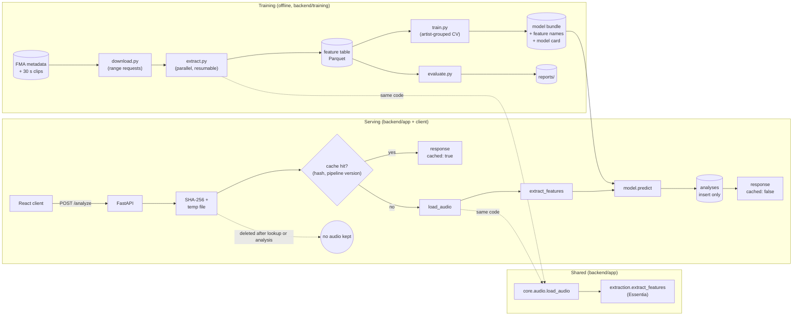

# Architecture

## Overview

SonicLens has two paths that share one extraction module. The **training pipeline** (offline)
turns FMA clips into a model. The **serving path** (API and web client) analyses uploads with the
same code and that model.

| Directory | Responsibility |
|---|---|
| `backend/app/core` | audio decoding and normalisation, model window, config, errors, version identifiers |
| `backend/app/extraction` | the single extraction function, the descriptor registry, CLI (`python -m app.extraction file.mp3`) |
| `backend/app/model` | loading and validating the model artifact, inference |
| `backend/app/db` | SQLAlchemy model and cache operations (lookup, insert) |
| `backend/app/api` | FastAPI routes, Pydantic schemas, upload handling |
| `backend/training` | download, extraction over FMA, training, evaluation |
| `client` | React + Vite single-page app |

## Train/serve consistency

The biggest risk in a project like this is training/serving skew: a model trained on features
computed one way and served features computed another way. SonicLens avoids this by
construction:

- **One extraction entry point:** `app.extraction.extract_features(audio, sr)`. The training
  scripts and the API both call it, with the same parameters, on audio decoded by the same loader
  (`app.core.audio.load_audio`). Tests assert that `training.extract` and the API service use
  these exact function objects, and that a training row equals a direct extraction of the same
  file.
- **The feature contract travels with the model.** The ordered list of 257 model input names and
  the `EXTRACTOR_VERSION` are saved in the model bundle. They are checked when the model loads;
  any mismatch fails loudly (see "Model loading").
- **`train.py` refuses to train** on a feature table extracted by a different extractor
  version.

## Two analysis scopes: full track vs. model window

`extract_features` analyses audio in two scopes:

| Scope | Used for | Why |
|---|---|---|
| **Full track** | Everything displayed: tempo, key, loudness, time signature, duration, beat grid, chroma, MFCC, signal descriptors | Users expect "the tempo of my song", not of an excerpt. |
| **Model window** (30 s) | The model input vector for the perceptual descriptors | The model was trained on 30 s FMA clips and should see the same kind of input. |

**Window position.** FMA's `creation.py` cut each clip from the middle of the track:
`start = duration // 2 - 15` (in whole seconds), and copied tracks of 30 s or less whole.
`app.core.windowing.model_window` applies exactly this rule to uploads. So an uploaded full track
is analysed on the same excerpt that FMA would have taken from it, and the input distribution at
inference matches training.

**Edge cases.** Tracks shorter than 31 s are analysed whole, and the two scopes collapse into one
analysis pass. This also covers FMA clips themselves, which decode to slightly more or less than
30 s, so training extraction runs one pass per clip. For longer tracks, the window pass costs
about as much as analysing 30 s of audio: a 4-minute song takes ~5 s in total.

**Consequence.** The displayed low-level descriptors and the model inputs can differ for the same
track. For example, a song with a slow intro may show a full-track tempo that differs from the
tempo in its central 30 s. This is intended. The API returns the window position
(`model_input.window`), and the client shades it on the beat timeline.

## Caching and versioning

Every result is stored in one table, `analyses`:

| Column | Content |
|---|---|
| `id` | primary key |
| `audio_hash` | SHA-256 of the raw uploaded bytes (indexed) |
| `pipeline_version` | `extractor-<EXTRACTOR_VERSION>+essentia-<package version>+model-<MODEL_VERSION>` |
| `created_at` | UTC time the result was computed |
| `features` | JSON: the full descriptor payload (no audio, no file name) |

There is a unique constraint on (`audio_hash`, `pipeline_version`).

- **Lookup:** `POST /analyze` hashes the upload while streaming it to disk, then looks up
  (hash, current pipeline version). A hit is returned with `cached: true`, and the audio is
  never decoded.
- **Insert only:** a miss runs extraction and prediction, inserts one row and returns
  `cached: false`. Nothing is ever updated or deleted, and there is no admin endpoint or tool
  for it. A test watches every SQL statement for UPDATE/DELETE.
- **Versioning:** changing the extractor, the Essentia build or the model changes the pipeline
  version. Old rows stay untouched, and the next upload of the same audio inserts a new row. The
  exact Essentia package version (e.g. `2.1b6.dev1389`) is used, not `essentia.__version__`
  (`2.1-beta6-dev`), which does not identify the build.
- **Races:** two concurrent uploads of the same new file both compute. The second insert hits the
  unique constraint, and that request returns the stored row.
- **Database:** SQLite by default (`backend/soniclens.db`). `SONICLENS_DATABASE_URL` accepts any
  SQLAlchemy URL, so PostgreSQL only needs the URL and a driver.

## Audio handling

Audio is never stored:

1. Uploads larger than the limit (`SONICLENS_MAX_UPLOAD_MB`, default 50) are refused with 413
   from their `Content-Length`, before the body is read. Uploads without a length are cut off
   while streaming.
2. Starlette buffers the multipart body in memory up to 1 MB, then in an anonymous temporary file.
   That file is unlinked at creation, so it never appears in the file system, and it is closed as
   soon as it is copied.
3. SonicLens streams the upload into one named temp file in `SONICLENS_TEMP_DIR`, hashing it on
   the way.
4. That file is deleted in a `finally` block right after the cache lookup (hit) or after analysis
   (success or error), before the result is written to the database. Tests assert the upload
   directory is empty after every request, including failed ones. Mutation testing (removing the
   deletion) confirmed that these tests fail.

Extraction runs in a worker thread (`run_in_threadpool`), so the event loop keeps serving other
requests.

## Model loading

At start-up the model artifact is validated against the running extractor: the ordered feature
names and the extractor version must match exactly. On a mismatch, or if the file is missing,
the API still starts, so `/health`, `/features` and `/model` keep working. The error is logged,
reported by `/health` (`model_error`), and `POST /analyze` answers 503 with the reason.

## Technology choices

- **Essentia over librosa** for extraction:
  - A broader and more musically informed descriptor set: key with several profiles, chords,
    HPCP, tuning, dissonance, pitch salience, spectral complexity, dynamic complexity, DFA
    danceability, BPM histogram and beat-synchronous loudness.
  - Standard EBU R128 loudness and loudness range (LRA).
  - Robust rhythm and key algorithms (`RhythmExtractor2013` multifeature, `KeyExtractor`).
  - A fast C++ core: ~1.5 s per 30 s clip.
  - It also measured better. On identical clips, the SonicLens Essentia features beat FMA's
    librosa feature set on 6 of 7 targets with half as many inputs (`TRAINING.md`).
- **AGPL-3.0 consequence.** Essentia is AGPL-3.0, and SonicLens links against it, so SonicLens is
  AGPL-3.0 too. Anyone who runs a modified SonicLens as a network service must offer its source
  to the service's users.
- **scikit-learn `HistGradientBoostingRegressor`**: strong on tabular features, no extra native
  dependencies on macOS, and it handles unscaled inputs. LightGBM was not needed.
- **FastAPI + Pydantic**: typed request and response models with OpenAPI docs at `/docs`.
- **SQLAlchemy + SQLite**: zero set-up locally, with a configurable URL for PostgreSQL.
- **React + Vite, no UI or chart library**: charts are small hand-built SVG components, which
  keeps the client's dependencies to React and Vite.

## Where batch processing would plug in

Batch/queue processing is out of scope, but the design leaves a clear seam. Today `POST /analyze`
runs `analyse_file(path, model)` (in `app/api/service.py`) in a thread and waits for it. A batch
version would:

1. keep the upload, hashing and cache lookup exactly as they are;
2. on a miss, enqueue a job (e.g. Redis + RQ/Celery) with the temp file path, and answer `202`
   with a job id;
3. have workers run the same `analyse_file` and `cache.insert`, then delete the file (the
   deletion must move to the worker);
4. let clients poll `GET /analyze/{audio_hash}`, which already exists, or a job-status endpoint.

`training/extract.py` is already a batch processor over the same function: a multiprocessing
pool, resumable, with failures logged.

## Testing

`backend/tests` (pytest, 62 tests, ~8 s, no FMA data needed):
- **Extraction:** synthetic audio with known properties, determinism, the output contract
  against the registry, and the model window rule.
- **Train/serve consistency:** training rows vs. direct extraction, and skipping of bad clips.
- **Training helpers:** artist-grouped splits and regression metrics.
- **Model loading and validation:** a tiny dummy model fixture.
- **API:** schemas, cache hit/miss, pipeline-version change, errors and limits, and two
  invariants on every test: an empty upload directory and no UPDATE/DELETE.

The client is type-checked and linted (`npm run build`, `npm run lint`). It was tested by hand in
a browser against the real API, including light and dark mode and screen width.
